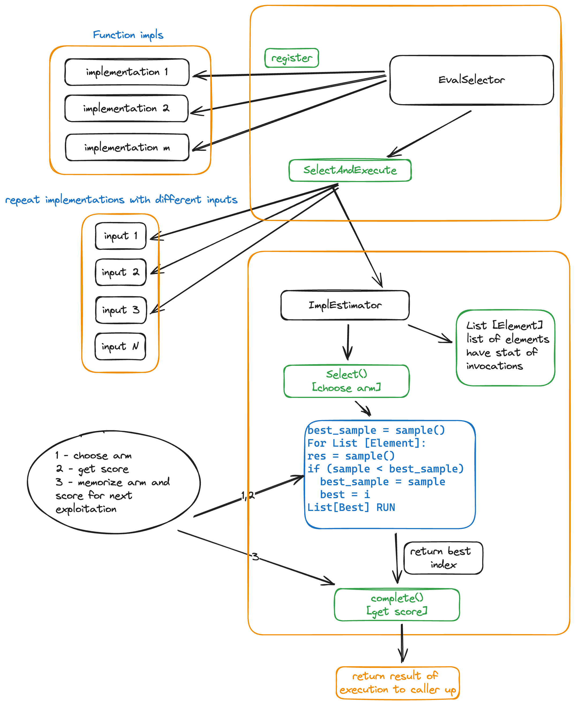
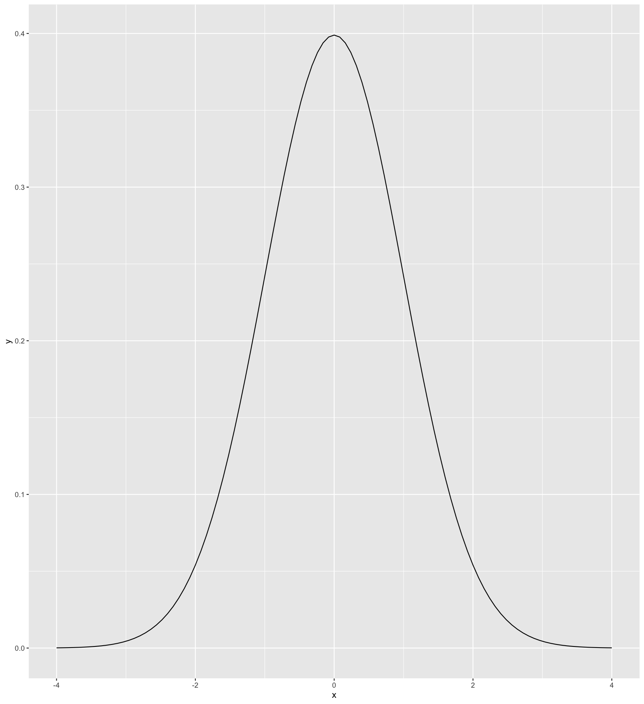
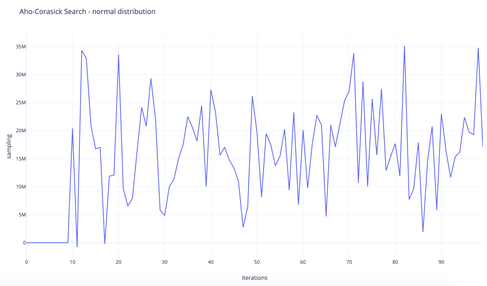
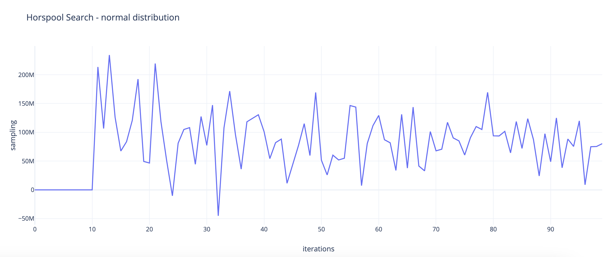
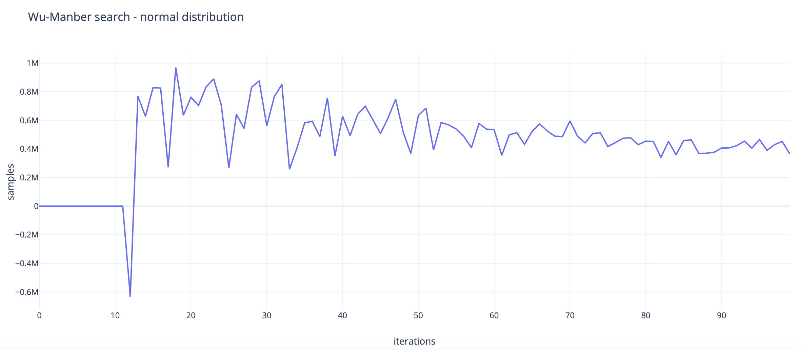
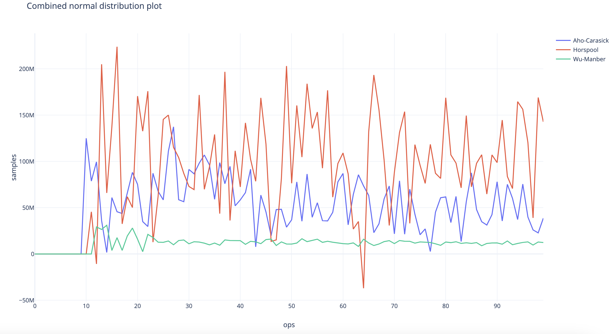
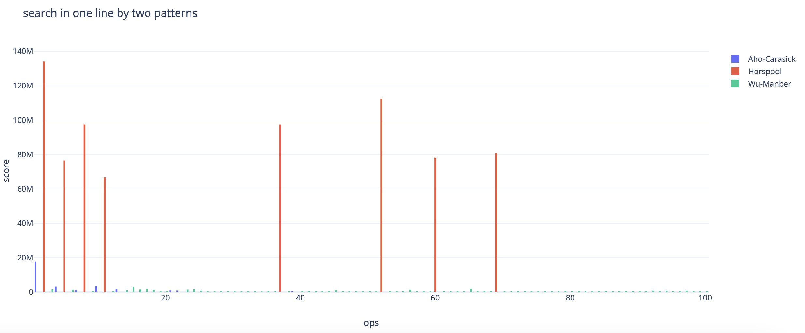
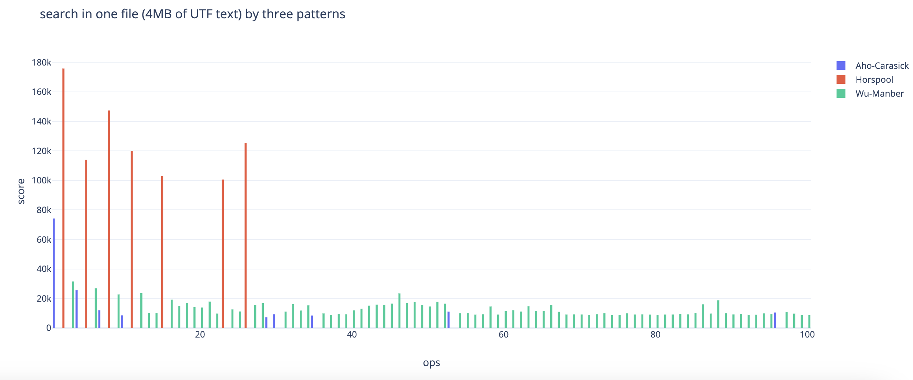
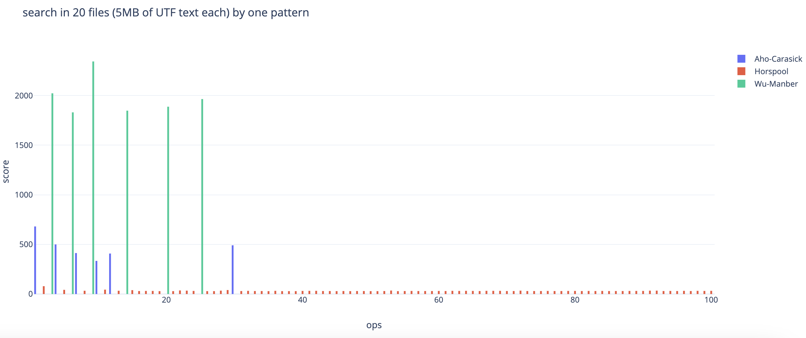
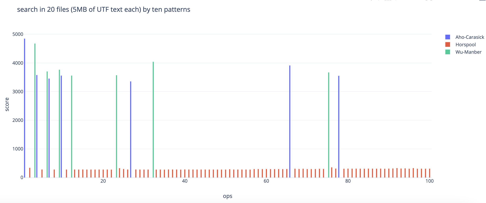

# search3
Implementation of evaluation with Bayesian Bandit strategy for dynamic identification 
of the best variant based on Gaussian randomization process based on the reasonable number of 
exploration attempts in order to search for the optimal score.

The Bayesian Bandit strategy can be succinctly encapsulated in three key steps:
- Select an arm.
- Obtain the associated score.
- Memorize the arm and score for subsequent exploitation.

For exploration have been used strategy to measure score (best time) of search by pattern, based on following algorithms:
- Aho-Carasick
- Horspool
- Wu-Manber

_Note 1: Search algorithms have been implemented manually without any third-party library._

_Note 2: Bayesian Bandit strategy explanation and exploration results are presented in `Explanation` and `Results` 
sections accordingly._

## Explanation
Score evaluation implementation is located in the package `src/main/java/org/alexgaas/estimate`:

- internal class **ImplEstimator** which performs _select / complete / emplace_ operations:
_src/main/java/org/alexgaas/estimate/ImplEstimator.java_
- public class **EvalSelector** provides public _contract to call evaluation_ based on **ImplEstimator**:
_src/main/java/org/alexgaas/estimate/EvalSelector.java_

High level design of _EvalSelector_:



For this implementation have been used **Gaussian Random Number Generator** (also known as normal distribution) from PCG library (library - https://www.pcg-random.org/download.html, JVM wrapper - https://github.com/KilianB/pcg-java). 
The randomness comes from atmospheric noise, which for many purposes is better than the pseudo-random number algorithms typically used in computer programs.

Simplest plot for a normal distribution looks like:



<details>
<summary>R snippet to plot simplest normal distribution</summary>

```R
#install (if not already installed) and load ggplot2
if(!(require(ggplot2))){install.packages('ggplot2')}
#generate a normal distribution plot
ggplot(data.frame(x = c(-4, 4)), aes(x = x)) +
stat_function(fun = dnorm)
```
</details>

Normal distribution for **Aho-Carasic** (100 repetitions) looks like:


Normal distribution **Horspool** (100 repetitions) looks like:


Normal distribution for **Wu-Manber** (100 repetitions) looks like:


If we combine normal distribution for 3 both we will get following plot (100 repetitions for small string and 2 patterns):


Normal distribution plot might be great indicator how predictable invocation and score consumption for different datasets.

Also, as result of research have been noted and implemented following:
- Cold invocations may provide incorrect stat, JVM have to be warmed up before accounting invocations
  Don't take first invocations into account. However, _you can increase invocation based on yours result expectations_.
Look on the `class ImplEstimator -> class Element -> int NUMBER_OF_INVOCATIONS_TO_THROW_OUT = 2` and adjust it in according particular results.
- For better convergence, I don't use proper estimate of Apache common math functions. Must to eventually separate between two algorithms even in case,
when there is no statistical significant difference between them.
Look on the `class ImplEstimator -> class Element -> double sigma()`
- If there is a variant with not enough statistics, I always choose it. And in that case _prefer variant with lesser number of invocations_.
  Look on the `class ImplEstimator -> class Element -> double sample()`

## Results
Testing been performed on Britannica data corpus - https://data.nls.uk/data/digitised-collections/encyclopaedia-britannica/

Results of evaluation can be found over running unit and integration tests:
- **_test/java/search_** folder includes **unit** and **integration** tests for 
_Aho-Carasic, Horspool, Wu-Manber_ search algorithms
- Evaluation tests using [EvalSelector] with registered implementations of search algorithms
for estimation are located in **_test/java/estimate_** folder

#### Evaluation test of _Aho-Carasic, Horspool, Wu-Manber_ search algorithms (20 repetitions):

_Basic test - search in one line by two patterns_:

_Patterns_: **announce, cpm**

_Text to search in_: **cpmxannualxconferencexannounce**
<details>
<summary>Results:</summary>

```text
[AhoCarasick]: 17.69 ms
[Harspool]: 132.8 ms
[WuManber]: 236.5 μs
[AhoCarasick]: 6.580 ms
[Harspool]: 76.71 ms
[WuManber]: 976.8 μs
[AhoCarasick]: 1.014 ms
[Harspool]: 97.96 ms
[WuManber]: 138.6 μs
[AhoCarasick]: 915.5 μs
[Harspool]: 86.38 ms
[WuManber]: 988.8 μs
[WuManber]: 930.8 μs
[WuManber]: 171.5 μs
[WuManber]: 2.282 ms
[WuManber]: 754.3 μs
[WuManber]: 1.378 ms
[AhoCarasick]: 651.7 μs
[WuManber]: 352.0 μs
[WuManber]: 145.3 μs
```
</details>

Plot result (in nanoseconds - 100 repetitions):


_Test - search in one file (4MB of UTF text) by three patterns_:

_Patterns_: **ENCYCLOPEDIA, BRITANNICA, ENCYCLOPEDIA BRITANNICA**

_Text to search in_: `src/test/resources/text/144133901.txt`
<details>
<summary>Results:</summary>

```text
[AhoCarasick]: 72.96 ms
[Harspool]: 198.9 ms
[WuManber]: 40.73 ms
[AhoCarasick]: 24.35 ms
[Harspool]: 117.6 ms
[WuManber]: 24.85 ms
[AhoCarasick]: 12.54 ms
[Harspool]: 120.0 ms
[WuManber]: 23.52 ms
[AhoCarasick]: 8.030 ms
[Harspool]: 118.6 ms
[WuManber]: 16.76 ms
[AhoCarasick]: 8.512 ms
[WuManber]: 12.23 ms
[WuManber]: 10.19 ms
[WuManber]: 10.07 ms
[AhoCarasick]: 11.49 ms
[WuManber]: 17.82 ms
[AhoCarasick]: 8.976 ms
[WuManber]: 12.61 ms
```
</details>

Plot result (in microseconds - 100 repetitions):


_Test - search in 20 files (5MB of UTF text each) by one pattern_:

_Patterns_: **it**

_Text to search in folder_: `src/test/resources/text/`
<details>
<summary>Results:</summary>

```text
[AhoCarasick]: 665.0 ms
[Harspool]: 69.08 ms
[WuManber]: 2.050 s
[AhoCarasick]: 503.4 ms
[Harspool]: 37.27 ms
[WuManber]: 1.527 s
[AhoCarasick]: 322.9 ms
[Harspool]: 30.27 ms
[WuManber]: 1.513 s
[AhoCarasick]: 324.4 ms
[Harspool]: 40.07 ms
[WuManber]: 2.175 s
[Harspool]: 30.28 ms
[Harspool]: 29.86 ms
[AhoCarasick]: 325.8 ms
[Harspool]: 30.34 ms
[Harspool]: 27.80 ms
[Harspool]: 28.01 ms
[Harspool]: 29.55 ms
[Harspool]: 28.07 ms
```
</details>

Plot result (in milliseconds - 100 repetitions):


_Test - search in 20 files (5MB of UTF text each) by ten patterns_:

_Patterns_: **it,different,determined,may,metallic,compreffed body,fubclavian,fire,aluminous,got**

_Text to search in folder_: `src/test/resources/text/`
<details>
<summary>Results:</summary>

```text
[AhoCarasick]: 5.083 s
[Harspool]: 336.5 ms
[WuManber]: 4.264 s
[AhoCarasick]: 3.617 s
[Harspool]: 280.7 ms
[WuManber]: 5.649 s
[AhoCarasick]: 3.754 s
[Harspool]: 285.7 ms
[WuManber]: 4.466 s
[AhoCarasick]: 3.879 s
[Harspool]: 276.9 ms
[WuManber]: 4.371 s
[Harspool]: 277.9 ms
[AhoCarasick]: 3.460 s
[Harspool]: 277.5 ms
[AhoCarasick]: 3.509 s
[Harspool]: 278.3 ms
[Harspool]: 305.5 ms
[Harspool]: 283.7 ms
[Harspool]: 280.8 ms
```
</details>

Plot result (in milliseconds - 100 repetitions):


## Summary of results

The Bayesian Bandit strategy stands out as an invaluable tool for constructing adaptive strategies, 
adept at navigating diverse scenarios to attain the optimal score.

Using implementation of this strategy to evaluate performance of following algorithms: Aho-Corasick, Horspool, Wu-Manber I got following results:

- Horspool demonstrates exceptional performance, particularly in straight searches on extensive string sources, such as a 100MB file. 
It outperforms competitors by a notable margin, approximately 10-20 times faster. Its efficacy is particularly pronounced when searching with a single pattern.
- Wu-Manber exhibits impressive and consistently predictable performance when applied to smaller or medium-sized strings, 
typically around 5MB or less, especially when handling a limited number of patterns. In these conditions, it surpasses Horspool by a factor of approximately 10.
- Aho-Corasick also showcases outstanding performance, comparable to Wu-Manber when applied to smaller files. 
It may even surpass Wu-Manber in speed, albeit with potentially less predictable invocation based on the scoring system.

**Combining different implementations using `Bayesian Bandit` strategy provides effective adaptive control to achieve
best score for different patterns and data sources.**

## TODO
- Batch execution

Execution of batches (like use 10, 100, 1000, ... executions as one measurement) will make your score much more **precision**.
Easiest way to make that working is just extend `ImplEstimator -> Element -> complete` as:
```java
void complete(double nanos, int items){
    --running_count;
    ++completed_count;
    if (adjustedCount() > 0)
        sum += nanos / items;
}
```

- Time score (elapsed time)

Calculated using **_Google Guava_** `Stopwatch`
```
Stopwatch watch = Stopwatch.createStarted();
...
watch.stop();
stat.Complete(id, watch.elapsed().getNano());
```
what is great (in fact idiomatic) approach for any Java program,
but that could be more effective using **_rsdtsc_** for x86/x64 (look this package here - https://github.com/dterei/gotsc as starting point) 
or _cntvct_el0_ for arm64 M1/M2 (discussion is here - https://stackoverflow.com/questions/40454157/is-there-an-equivalent-instruction-to-rdtsc-in-arm)
with **JVMCI** (see amazing **_nalim_** example - https://github.com/apangin/nalim).

- As randomization process to choose arm have been used normal distribution. 
For implementation of normal distribution function have been used JNI port of PCG C implementation - https://github.com/KilianB/pcg-java
```
/*
    Pcg have been used for fastest random generation - see results on this Github page:
    https://github.com/KilianB/pcg-java
    (or just use Random() from standard lib if performance does not matter to you)
 */
return mean() + PcgRSUFast.nextGaussian() * sigma();
```
This port provides much better performance (three times faster) than `Random` class from standard JDK library, but could even
faster calling by **JVMCI** directly from C library instead of wrappper with JNI.

## License
MIT - https://github.com/git/git-scm.com/blob/main/MIT-LICENSE.txt